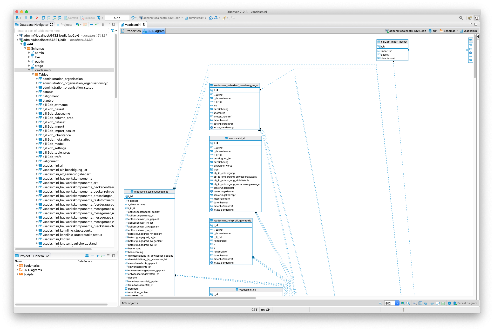

# vsa-dss-mini-ili2pg

```
docker run --rm --name edit-db -p 54321:5432 --hostname primary \
-e PG_DATABASE=edit -e PG_LOCALE=de_CH.UTF-8 -e PG_PRIMARY_PORT=5432 -e PG_MODE=primary \
-e PG_USER=admin -e PG_PASSWORD=admin \
-e PG_PRIMARY_USER=repl -e PG_PRIMARY_PASSWORD=repl \
-e PG_ROOT_PASSWORD=secret \
-e PG_WRITE_USER=gretl -e PG_WRITE_PASSWORD=gretl \
-e PG_READ_USER=ogc_server -e PG_READ_PASSWORD=ogc_server \
sogis/oereb-db:latest
```

```
java -jar /Users/stefan/apps/ili2pg-4.4.2/ili2pg-4.4.2.jar --dbhost localhost --dbport 54321 --dbdatabase edit --dbusr admin --dbpwd admin \
--defaultSrsCode 2056 --createGeomIdx --createFk --createFkIdx --createUnique --createEnumTabs --beautifyEnumDispName --createMetaInfo --createNumChecks --createImportTabs	--nameByTopic --strokeArcs \
--createBasketCol --createDatasetCol \
--models VSADSSMINI_2020_LV95 --modeldir "https://vsa.ch/models;https://models.geo.admin.ch;http://models.interlis.ch/" \
--schemaimport
```

führt zu folgendem Fehler:

```
Info: dburl <jdbc:postgresql://localhost:54321/edit>
Info: dbusr <admin>
Info: ili2pg-4.4.2-7b1d50437cd6970a801b16d177c4e27151414569
Info: ili2c-5.0.8-20200401
Info: iox-ili-1.20.18-7a02b8adf5b67aa75bed55225333244d63cf6986
Info: java.version 1.8.0_252
Info: user.name <stefan>
Info: maxMemory 5592576 KB
Info: currentTime 2020-11-03 09:41:36
Info: dburl <jdbc:postgresql://localhost:54321/edit>
Info: dbusr <admin>
Info: databaseProduct <PostgreSQL>
Info: databaseVersion <11.2>
Info: driverName <PostgreSQL JDBC Driver>
Info: driverVersion <42.1.4.jre6>
Info: postGISVersion <POSTGIS="2.4.6 r17068" PGSQL="110" GEOS="3.7.0-CAPI-1.11.0 673b9939" PROJ="Rel. 4.9.3, 15 August 2016" GDAL="GDAL 1.11.4, released 2016/01/25" LIBXML="2.9.1" LIBJSON="0.11" RASTER>
Info: compile models...
Info: lookup model <VSADSSMINI_2020_LV95> in repository <https://vsa.ch/models/>
Info: lookup model <Units> 2.3 in repository <https://vsa.ch/models/>
Info: lookup model <Units> 2.3 in repository <https://models.geo.admin.ch/>
Info: lookup model <Units> 2.3 in repository <http://models.interlis.ch/>
Info: lookup model <Base_LV95> 2.3 in repository <https://vsa.ch/models/>
Info: lookup model <SIA405_Base_Abwasser_LV95> 2.3 in repository <https://vsa.ch/models/>
Error: failed to get ili file https://vsa.ch/models//Base_d-20181005.ili
compiler failed
```

Das Problem scheint ein falscher Link in der Datei `https://vsa.ch/models/ilimodels.xml` zu sein:

```
<IliRepository09.RepositoryIndex.ModelMetadata TID="6">
<Name>Base_LV95</Name>
<SchemaLanguage>ili2_3</SchemaLanguage>
<File>Base_d-20181005.ili</File>
<Version>05.10.2018</Version>
<dependsOnModel>
<IliRepository09.ModelName_>
<value>Units</value>
</IliRepository09.ModelName_>
</dependsOnModel>
<Issuer>http://www.vsa.ch/models</Issuer>
<technicalContact>mailto:stefan.burckhardt@sjib.ch</technicalContact>
<md5>9f4663ef5fa8f7dc3e5d764a9223a0c6</md5>
</IliRepository09.RepositoryIndex.ModelMetadata>
```

Der Interlis-Compiler sucht die Datei `https://vsa.ch/models/Base_d-20181005.ili`. Der Link muss aber `https://vsa.ch/models/2020/Base_d-20181005.ili` lauten.

Workaround: ILI-Files herunterladen (siehe --modeldir):

```
java -jar /Users/stefan/apps/ili2pg-4.4.2/ili2pg-4.4.2.jar --dbhost localhost --dbport 54321 --dbdatabase edit --dbusr admin --dbpwd admin \
--defaultSrsCode 2056 --createGeomIdx --createFk --createFkIdx --createUnique --createEnumTabs --beautifyEnumDispName --createMetaInfo --createNumChecks --createImportTabs	--nameByTopic --strokeArcs \
--createBasketCol --createDatasetCol \
--models VSADSSMINI_2020_LV95 --modeldir ".;https://models.geo.admin.ch;http://models.interlis.ch/" \
--dbschema vsadssmini --schemaimport
```

oder

```
java -jar /Users/stefan/apps/ili2pg-4.4.2/ili2pg-4.4.2.jar \
--defaultSrsCode 2056 --createGeomIdx --createFk --createFkIdx --createUnique --createEnumTabs --beautifyEnumDispName --createMetaInfo --createNumChecks --createImportTabs	--nameByTopic --strokeArcs \
--createBasketCol --createDatasetCol \
--models VSADSSMINI_2020_LV95 --modeldir ".;https://models.geo.admin.ch;http://models.interlis.ch/" \
--dbschema vsadssmini --createscript vsa_dss_mini.sql
```




